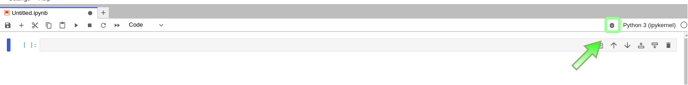
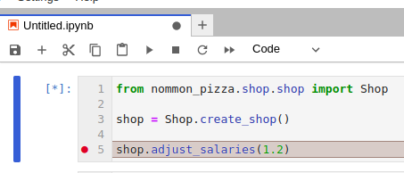
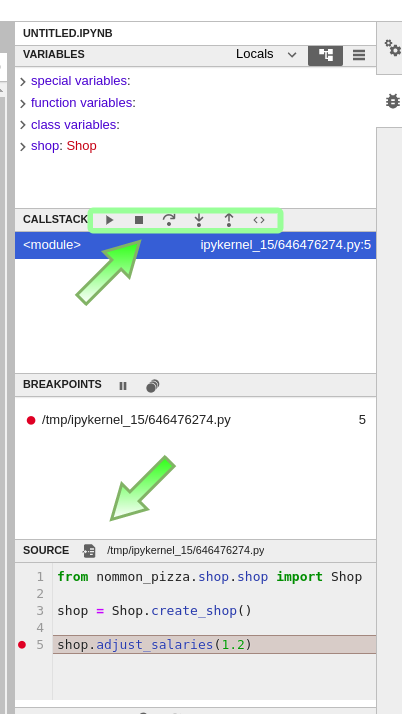
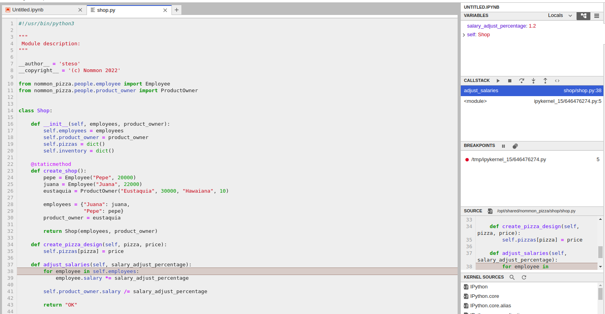

# Pycharm-Workshop

## Exercise 2 - Debug and win

In this exercise you will practise running tests within a docker and debugging code.  
We will use the nommon-base-py3 image for running this Python3 code. 

If the image doesn't exist. Open the pycharm terminal and use the command.

`./resources/docker/start_nommon_base_py3.sh -i`

For creating and running a docker container:

`./resources/docker/start_nommon_base_py3.sh -r`

---
If there are errors because the container already exists:

Option 1:
 * Start the stopped container: `./resources/docker/start_nommon_base_py3.sh`

Option 2:
 * Delete the stopped container: `./resources/docker/start_nommon_base_py3.sh -d`
 * Create a new container: `./resources/docker/start_nommon_base_py3.sh -r`

It is recommended to delete and create again the container for this exercise 
if you encounter this problem. 

---

Within the docker container use the following command to run the tests:

`pytest tests/tests_code/nommon_pizza`

**The tests are failing!**

Open a Jupyter Lab inside the docker and debug the code to fix the issues.

For opening a jupyter lab, use the command `jl` within the docker terminal.  
You ~~should~~ **MUST** use the debug tool of jupyter lab.

---

### How to debug

For starting debugging mode in JupyterLab press the debug button.

Now you can put a breakpoint in the function to test

At the right of the screen you can see the usual debug functions.
Shortcuts:
 * `F10` To go to the next sentence
 * `F11` To step inside the function

Clicking the file path in the source tab will maximize the file that is debugged.

---

**_The only code that needs to be changed is the function that gives the error._**

